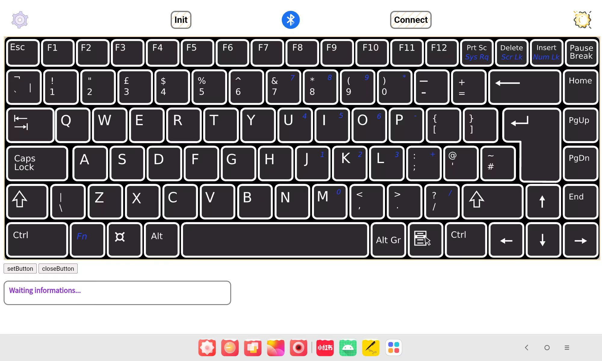
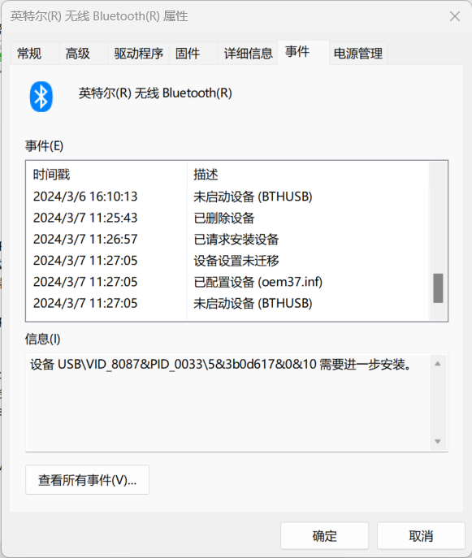

# keyboard

#### 介绍

Android Studio开发的模拟蓝牙键盘

#### 构建方式
1. 开发环境：
   - 系统：Windows11 23H2
   - Java：`java version "1.8.0_371"  Java(TM) SE Runtime Environment (build 1.8.0_371-b11)  Java HotSpot(TM) 64-Bit Server VM (build 25.371-b11, mixed mode)`
   - Android studio：```Android Studio Iguana | 2023.2.1
Build #AI-232.10227.8.2321.11479570, built on February 22, 2024
Runtime version: 17.0.9+0--11185874 amd64```
   - Android SDK版本最低为**SDK28**，也即**API28**，但建议为更高的版本
   - 调试ADB版本：`Android Debug Bridge version 1.0.41
Version 34.0.4-10411341`
   - 测试的安卓API版本：**API33->Android 13,API34->Android 14**
2. 构建方式：打开Android studio，执行`build apk`即可打包为APK安装包。
3. 注意事项：需要提前配置Java + Android SDK环境。可以通过logcat分析日志，需要手机开启USB调试即可。


#### 设计说明书
1. 后端：
   - 路径：`MyApplication\app\src\main\java\com\example\myapplication`
   - 构建方式：使用安卓`Webview`技术构建前端，与后端交互，语言为`java`；
   - 核心技术：使用安卓在**API28**后开放的`BluetoothHidDevice`库构建。详细问题可以参考CSDN博客<a href="https://blog.csdn.net/FengyunTHU/article/details/136437262#comments_31500696">*Android模拟蓝牙蓝牙键盘——适配Android和Windows*</a>；
   - 文件说明(*其中存在一些声明但未使用的方法*)：
      - `MainActivity.java`**主线程文件**。包括webview页面的初始化，以及生命周期方法`onCreate()`；
      - `callBluetooth.java`**蓝牙功能文件**。实现蓝牙HID服务的本机注册初始化，发起蓝牙连接，发送键盘键位信息，以及一系列回调。期望实现蓝牙主动发起扫描并呈现设备列表，但暂未实现。也提供Mac地址连接方式，以后期望实现更方便的Mac地址输入；
      - `HidConfig.java`**HID描述符文件**。通过正确的描述符可以成功注册为HID键盘设备，并为所连接设备所识别。其中包括设备的名称、提供者、ID等等。**目前的描述符有一定的兼容性问题，在Android和Windows平台上可以正常作用的描述符存在不同，仍在优化中**。可以通过更换描述符来在不同平台使用，可能后期会完成切换描述符的功能。文件中也定义了很多描述符，可以在打包时替换；
      - `JavaScriptInterfaces.java`**一些提供给前端的JavaScript接口**。主要的作用是实现键盘图片和键位信息的更换。期望实现APP内部直接的键位划分以及自动的键位识别，目前未实现；
      - `KeyMap.java`**定义每个键位在HID传输中对应的字节**。目前依然存在一些问题，一些键盘无法正确传出；
      - `Vibrators.java`**实现设备马达震动**。在按下键盘时震动优化手感，需要注意的是有的设备不支持线性马达震动。
   - 一些配置文件：
      - `MyApplication\app\src\main\AndroidManifest.xml`**权限声明文件**
      - `MyApplication\app\src\main\res\layout\activity_main.xml`**UI声明文件**
   - 后期计划引入**触控板、鼠标、数位板**等等键盘之外的HID设备。
2. 前端
   - 构建技术：使用**HTML+CSS+JavaScript**构建；
   - 文件位于`MyApplication\app\src\main\assets`下；
   - `index.html`为主页面，`css,js,img,data,html`文件夹分别存放样式表、JavaScript脚本、图片素材、初始化键位数据、子页面；
   - `bluetooth.js,temp.js,test_touch.js`暂未使用；
   - 已经实现了前端的初步优化。暂未实现多点触控，使用的是button的click事件，后期计划加入，使用按下松开事件。即暂不支持如**shift+a**类型的输入。前端的一些细节包括颜色和尺寸也需要调整，以及一些动画的优化；
   - 点击左上角的设置展开菜单，目前**按键反馈+恢复默认**暂未实现；
   - 左下角两个按钮的样式未优化。点击左侧按钮可以出现键位设置，右侧则使标记消失。目前未解决多边形键位的问题，所以点下左侧后会在下方额外出现一个红框。
3. **目前还未完善异常处理机制**。

#### 使用说明

1. 使用 `Readme_XXX.md` 来支持不同的语言，例如 `Readme_en.md // 暂无`, `Readme_zh.md`
2. 开启APP时需要开启安卓设备+所连接设备蓝牙；
3. 页面左上角滚动设置图片，点击可以展开菜单。点击更换键盘即可更换键盘图片，更换后需要导入对应格式的键盘文件；
4. 导入图片支持的格式有：

   - 传统位图格式：`.png,.jpeg,.bmp`;
   - 矢量图格式（推荐）：`.svg(.xml)`;
   - 其他图像格式：`.gif,.webp,.heif`;
5. 导入键位信息文件标准：

   - 使用 `.txt/.csv`格式导入;
   - `.txt/.csv`文件的内容结构标准示例（注释不需要包含）：

   ```txt
   82  // 总键位数
   esc,15,13,10    // 键位名称+相对于图片原尺寸的坐标
   f1,45,12,11
   f2,77,14,12
   f3,105,12,12
   ……  ……  ……  ……  // 此处省略其他键位信息
   ctrl,379,161,413,188
   left,416,161,446,188
   down,449,161,477,188
   right,481,160,510,189
   ```

   - 提供键位的位置信息数字即可，如 `15,13,10`。会自动依据所给的数字个数分配 `area.shape`，包含 `=3->circle(圆),=4->rect(矩形),≥5->poly(多边形)`。推荐使用网站 <a href="https://www.image-map.net">image map generator </a>；
6. **注意更换键盘图片+导入键位信息**的功能**未进行测试**，建议不要使用；
7. 点击右上角的太阳🌞可以切换亮色暗色；
8. 点击左下角的按钮可以实现键位标记的生成+去除；
9. **蓝牙连接**：
   1.  点击中间的蓝牙图片展开按钮。点击init进行初始化，注意此时蓝牙应当处于打开状态。init如弹出权限申请，同意后需要**再次init**；
   2.  点击connect输入连接设备的蓝牙Mac地址。输入完成点击确定即可发起连接。未配对过配对后再connect即可；
   3.  再次点击蓝牙图片即可收回按钮；
   4.  按下对应键位即可发送对应的按键信息；
10. 左下角灰色框打印连接信息，可以上下滑动；
11. 出现HID服务连接不上或连接上无法发送报告，可以参考<a href="https://blog.csdn.net/FengyunTHU/article/details/136437262#comments_31500696">*Android模拟蓝牙蓝牙键盘——适配Android和Windows*</a>。**可能是驱动或HID描述符的问题**；
12. 如果出现闪退，很可能是你手机厂商**封锁了HID API**；
13. 示意图：

#### 开发历程

1. 开发模拟蓝牙键盘是个人一直想写的项目，比赛算是一个督促；
2. `2024/2/24:`软件在 `Android`上报错了…
3. `2024/2/28:`代码中包含很多的 `Log.d(TAG,"String")`来输出日志信息以便于修改错误；
4. 使用安卓原生来构建，是因为web技术的Bluetooth API权限不够；
5. 最费时间的是库说明文档的尝试学习；
6. 正是需要蓝牙的时候，电脑蓝牙竟然坏了😢，只好求助同学了...