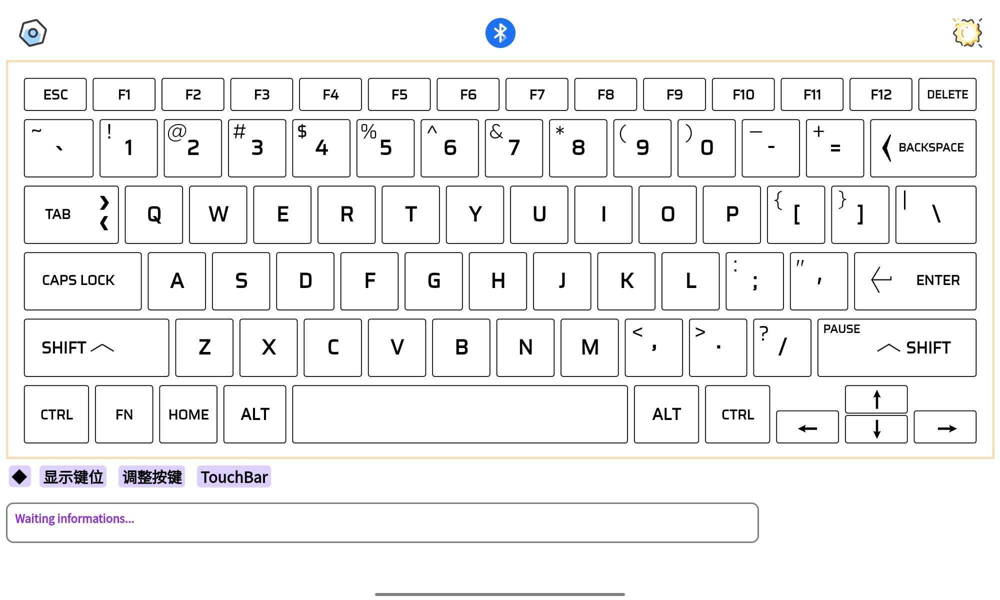
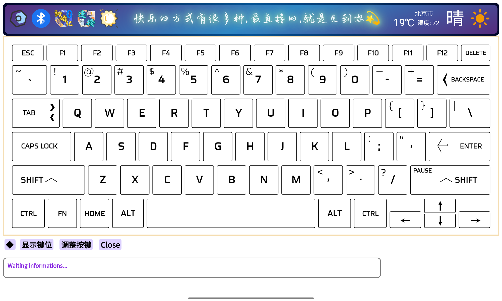

# keyboard of bluetooth v0.2-alpha

#### 介绍

Android Studio开发的模拟蓝牙键盘

#### 构建方式
1. 开发环境：
   - 系统：Windows11 23H2
   - Java：`java version "1.8.0_371"  Java(TM) SE Runtime Environment (build 1.8.0_371-b11)  Java HotSpot(TM) 64-Bit Server VM (build 25.371-b11, mixed mode)`
   - Android studio：```Android Studio Iguana | 2023.2.1 Patch 2
Build #AI-232.10300.40.2321.11668458, built on April 4, 2024
Runtime version: 17.0.9+0--11185874 amd64```
   - Android SDK版本最低为**SDK28**，也即**API28**，但建议为更高的版本
   - 调试ADB版本：`Android Debug Bridge version 1.0.41
Version 34.0.4-10411341`
   - 测试的安卓API版本：**API33->Android 13,API34->Android 14**
2. 构建方式：打开Android studio，执行`build apk`即可打包为APK安装包。导入项目时应当会自动sync所依赖的包。
3. 注意事项：需要提前配置Java + Android SDK环境。可以通过logcat分析日志，需要手机开启USB调试即可。


#### 设计说明书
1. 后端（文件结构无显著变化）：
   - 路径：`MyApplication\app\src\main\java\com\example\myapplication`
   - 构建方式：使用安卓`Webview`技术构建前端，与后端交互，语言为`java`；
   - 核心技术：使用安卓在**API28**后开放的`BluetoothHidDevice`库构建。详细问题可以参考CSDN博客<a href="https://blog.csdn.net/FengyunTHU/article/details/136437262#comments_31500696">*Android模拟蓝牙蓝牙键盘——适配Android和Windows*</a>；
   - 文件说明(*其中存在一些声明但未使用的方法*)：
      - `MainActivity.java`**主线程文件**。包括webview页面的初始化，以及生命周期方法`onCreate()`；
      - `callBluetooth.java`**蓝牙功能文件**。实现蓝牙HID服务的本机注册初始化，发起蓝牙连接，发送键盘键位信息，以及一系列回调。~~期望实现蓝牙主动发起扫描并呈现设备列表，但暂未实现。也提供Mac地址连接方式，以后期望实现更方便的Mac地址输入~~目前实现了识别自己设备已经配对的设备，并支持**点击加入输入框**。蓝牙扫描功能代码完成，但存在bug，即已经配对的设备*无法更新状态*。优化了输入框的UI界面；优化了发送报告的逻辑，增加了**组合键**的支持；
      - `HidConfig.java`**HID描述符文件**。通过正确的描述符可以成功注册为HID键盘设备，并为所连接设备所识别。其中包括设备的名称、提供者、ID等等。**目前的描述符有一定的兼容性问题，在Android和Windows平台上可以正常作用的描述符存在不同，仍在优化中**。可以通过更换描述符来在不同平台使用，可能后期会完成切换描述符的功能。文件中也定义了很多描述符，~~可以在打包时替换~~增加了替换描述符的功能，替换后需要**再次init**；
      - `JavaScriptInterfaces.java`**一些提供给前端的JavaScript接口**。主要的作用是实现键盘图片和键位信息的更换。~~期望实现APP内部直接的键位划分以及自动的键位识别，目前未实现~~抛弃了识别键位的想法，增加了**背景设置**，可以设置键盘的背景；增加了**图片裁剪**，支持从相册选图进行设置；支持调节透明度；
      - `KeyMap.java`**定义每个键位在HID传输中对应的字节**。~~目前依然存在一些问题，一些键盘无法正确传出~~ 优化字节设置，移除不必要的shift集合，直接发送组合键即可；
      - `Vibrators.java`**实现设备马达震动**。在按下键盘时震动优化手感，需要注意的是有的设备不支持线性马达震动。
   - 一些配置文件：
      - `MyApplication\app\src\main\AndroidManifest.xml`**权限声明文件**
      - `MyApplication\app\src\main\res\layout\activity_main.xml`**UI声明文件**
      - `EMyApplication\app\src\main\res\drawable`**一些着色文件**
      - `E:\MyApplication\app\src\main\res\layout`**一些布局文件，主要实现Mac连接框的UI设置+扫描设备的底部弹窗布局**
   - ~~后期计划引入**触控板、鼠标、数位板**等等键盘之外的HID设备。~~ 没有充足的时间来完成。目前计划开放一些代码接口（未完成），供后续开发方便的导入功能。
2. 前端
   - 构建技术：使用**HTML+CSS+JavaScript**构建；
   - 文件位于`MyApplication\app\src\main\assets`下；
   - `index.html`为主页面，`css,js,img,data,html`文件夹分别存放样式表、JavaScript脚本、图片素材、初始化键位数据、子页面；
   - `bluetooth.js,temp.js,test_touch.js`暂未使用；
   - 已经实现了前端的初步优化。~~暂未实现多点触控，使用的是button的click事件，后期计划加入，使用按下松开事件。~~ 使用`touchstart`和`touchend`事件实现多点触控，同时实现了长按+组合键；~~即暂不支持如**shift+a**类型的输入。~~ (**已经实现了组合键的正确输入**)。前端的一些细节包括颜色和尺寸进行了调整，一些动画进行了优化；
   - 点击左上角的设置展开菜单，~~目前**按键反馈+恢复默认**暂未实现~~ 移除**按键反馈**，添加**描述符设置**，支持更换描述符；添加**touchbar**，美化顶部样式，添加了文字显示和天气选项；
   - ~~左下角两个按钮的样式未优化。点击左侧按钮可以出现键位设置，右侧则使标记消失。目前未解决多边形键位的问题，所以点下左侧后会在下方额外出现一个红框。~~ 优化样式，并设置为一个可回收的选项卡。
3. ~~**目前还未完善异常处理机制**~~ 目前以经尽力完善了异常处理机制，包括前端的点击失败，后端权限超出等等。
4. **<font color="red">目前还未完成本地保存机制。</font>**
5. 思路来源+设计目的：主要是自己对于一个方便键盘的思考。自己购置了一个蓝牙键盘后，完全由自己想出去把安卓设备改造为蓝牙键盘这个点子。设计目的一方面是更加方便，随时随地都有键盘，不需要费力的输入文字（如班班通）。同时也希望作为自己一个**开源**历程的开始，在一开始就开源了仓库，自己本身也是很喜欢开源精神；**在网络上有一些案例，但多数都已经失效**。其次在设计**游戏**盛行的软设大赛上，也想作一个原生的、工具类的项目；
6. 分工情况：**独立开发者**（独立开发者真的很难）。

#### 使用说明

1. 使用 `Readme_XXX.md` 来支持不同的语言，例如 `Readme_en.md // 暂无`, `Readme_zh.md`
2. 开启APP时需要开启安卓设备+所连接设备蓝牙；
3. 页面左上角滚动设置图片，点击可以展开菜单。点击更换键盘即可更换键盘（背景）图片，~~更换后需要导入对应格式的键盘文件~~；
4. 导入图片（背景）支持的格式有：

   - 传统位图格式：`.png,.jpeg,.bmp`;
   - 矢量图格式（推荐）：`.svg(.xml)`;
   - 其他图像格式：`.gif,.webp,.heif`;
5. **移除导入键位功能**。切换为自己绘画的透明键盘图片`svg.svg`，键位采用全方形易于调控，且易于优化按下效果；
6. **注意更换键盘图片+导入键位信息**的功能**未进行测试**，建议不要使用；
7. 点击右上角的太阳🌞可以切换亮色暗色；
8. 点击左下角的按钮可以实现键位标记的生成+去除；
9. **蓝牙连接**：
   1.  点击中间的蓝牙图片展开按钮。点击init进行初始化，注意此时蓝牙应当处于打开状态。init如弹出权限申请，同意后需要**再次init**；
   2.  点击connect输入连接设备的蓝牙Mac地址。输入完成点击确定即可发起连接。未配对过配对后再connect即可；
   3.  再次点击蓝牙图片即可收回按钮；
   4.  按下对应键位即可发送对应的按键信息；
   5.  优化了**touchbar**:
       1.  在点击左下角的紫色框可以展开，点击**touchbar**可以在页面上方展开一个touchbar，同时移除原有元素；
       2.  点击设置打开设置界面；点击蓝牙图标向右展开两个按键（自己设计绘制），有文字提示；点击日月即可切换明暗；
       3.  点击右侧圆圈云朵刷新天气（使用的是我自己的API所以建议别使用太多次~）;
       4.  点击中间文字可以设置文字，点击外部关闭输入框恢复（貌似有字号bug不过已经尽力优化了，悲）；
10. 左下角灰色框打印连接信息，可以上下滑动（至多50条）；
11. 出现HID服务连接不上或连接上无法发送报告，可以参考<a href="https://blog.csdn.net/FengyunTHU/article/details/136437262#comments_31500696">*Android模拟蓝牙蓝牙键盘——适配Android和Windows*</a>。**可能是驱动或HID描述符的问题**；
12. 如果出现闪退，很可能是你手机厂商**封锁了HID API**；
13. **增加了按键调整**。点击底部的**调整按键**，可以进入调整状态；此时长按**字母**键，可以进行按键字母更换，具体会弹出一个浮窗；点击目标键后页面svg元素也会同步刷新。**点击设置中的恢复默认**即可设置为原始键盘图+键位区域设置；
14. **增加切换描述符功能**。如果一个描述符不起作用，点击**设置**->**更换描述符**可以选择存储的描述符，上次的选择会标为**蓝色**。默认为描述符**5**。更换后需要再次**init**；
15. **优化了Mac地址获取**。可以发起蓝牙扫描，此时从页面底部升起弹窗（未美化）。点击所连接设备即可。**注意已经配对会显示未蓝牙断开，即使其已经开启蓝牙。直接点击即可**。点击后弹出弹窗二次确定；
16. 示意图：
17. 示意图：
18. **由于适配工作的困难性和复杂度，手机小屏存在键位错位等适配问题。建议使用大于10.5英寸的平板测试。**

#### 开发历程

1. 开发模拟蓝牙键盘是个人一直想写的项目，比赛算是一个督促；
2. `2024/2/24:`软件在 `Android`上报错了…
3. `2024/2/28:`代码中包含很多的 `Log.d(TAG,"String")`来输出日志信息以便于修改错误；
4. 使用安卓原生来构建，是因为web技术的Bluetooth API权限不够；
5. 最费时间的是库说明文档的尝试学习；
6. 正是需要蓝牙的时候，电脑蓝牙竟然坏了😢，只好求助同学了...
7. 碎碎念：硬件的debug确实比纯软件难多了~~感觉做起来确实比纯unity或小程序或网页复杂且耗脑子
8. 鉴于独立开发者的时间和精力，此文档有不完善之处敬请理解。